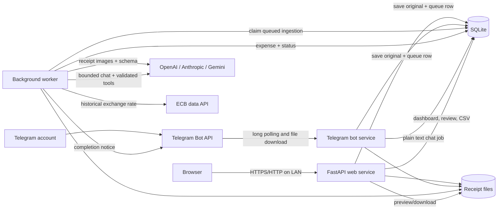

# Spendloom architecture

Spendloom is deliberately a small distributed system: three processes share one database and one receipt directory. Separating receipt intake from AI processing keeps uploads fast and makes the original document durable before any slow or unreliable external call begins.

## System map

The Docker services are:

- `web`: FastAPI JSON API, authentication, CSV export, and the compiled React application.
- `worker`: processes queued receipts and talks to the selected AI provider and the ECB.
- `telegram`: talks directly to Telegram using long polling. OpenClaw is not part of the system.

All three mount the same `./data` directory. The worker waits for the web service health check so database initialization finishes before processing starts.

## Telegram conversations

Plain text messages are durable `chat_jobs`, separate from receipt ingestion. A private chat owns one provider-neutral session with a receipt/expense anchor and up to eight user/assistant exchanges, discarded after 24 hours or roughly 6,000 input tokens. The worker uses the selected provider's tool-calling format but supplies one canonical tool contract. Tools search and inspect ledger records, calculate totals server-side, create or edit a single record, maintain settings records, and create CSV exports. They never expose SQL.

Archive, delete, replacement, and multi-record requests create an owner-bound `pending_actions` row instead of performing the write. Telegram Confirm/Cancel callbacks consume it once and it expires after ten minutes. This keeps model output advisory while deterministic code controls data access.

## The lifecycle of one receipt

### 1. Intake

A receipt enters through either `POST /api/ingestions` or a private message to the Telegram bot. Both paths call the same `ingest_bytes()` service, so validation and storage behavior do not drift between channels.

The intake service:

1. Checks the source message ID for idempotency.
2. Enforces the size limit and identifies the real MIME type from the bytes.
3. Calculates a SHA-256 digest for exact duplicate detection.
4. Writes the original atomically under `data/receipts/<year>/<month>/<receipt-id>/`.
5. Creates a `receipts` row and a queued `ingestions` row in one database transaction.

Telegram receives its “saved and queued” acknowledgement only after those steps complete. An AI outage therefore cannot lose an uploaded document.

### 2. Queue processing

The worker polls SQLite for the oldest queued ingestion. SQLite is the queue as well as the application database; there is no Redis, RabbitMQ, or cloud task service in this single-user version.

The worker marks the ingestion as processing and prepares model-friendly input:

- Images are orientation-corrected, converted to JPEG, and resized to a bounded resolution.
- PDFs are rendered to page images with Poppler. Embedded text is also extracted when available.
- A smaller first-page/image preview is stored under `data/previews/`.

The original is never replaced by the normalized model input.

### 3. Structured AI extraction

`services/extraction.py` defines a small provider interface with OpenAI, Anthropic, and Gemini implementations. Each provider must return the same validated `ReceiptExtraction` object:

- date and merchant;
- final paid total and ISO currency;
- category code and personal/business scope;
- payment hints, location, memo, and overall confidence.

The prompt contains only currently active category codes. Pydantic validates the response before it reaches the accounting model. With no configured provider key, the worker still creates a blank manual-review expense and retains the document.

### 4. Deterministic enrichment

AI extraction is not the final authority. The processing service applies deterministic logic afterward:

1. Normalizes the merchant name.
2. Applies an enabled learned merchant rule, which can override category, payment method, and scope.
3. Matches a payment method by its last four digits, otherwise using the configured default.
4. Converts the original amount to EUR using a cached ECB rate.
5. Checks for a semantic duplicate using date, normalized merchant, original amount, and currency.

For weekends and holidays, the latest ECB rate within the prior seven days is used. `fx_rate_date` records the effective day and `fx_estimated` is true when it differs from the expense date.

### 5. Review or automatic acceptance

An expense is accepted only when its required fields are complete and an EUR amount is available. The review setting then controls the result:

- `always`: every receipt enters the review inbox.
- `uncertain`: complete receipts at or above the confidence threshold are accepted; others need review.
- `never`: complete receipts are accepted regardless of model confidence.

Potential semantic duplicates always enter review. When the owner accepts a correction and selects “Remember for this merchant”, the app creates a merchant rule for later receipts. Conflicting corrections disable the rule instead of silently choosing one.

### 6. Presentation and export

The React frontend calls the same-origin FastAPI API. It provides the overview, searchable ledger, review inbox, receipt-side editor, configuration, and learned-rule management.

Accepted expenses feed dashboard totals and the Ramp-shaped CSV export. The database keeps the original currency values, normalized EUR amount, applied conversion rate, source receipt, confidence, scope, and QuickBooks mapping fields so exports do not need to reconstruct history.

## Data model

The main records have different responsibilities:

| Record | Purpose |
| --- | --- |
| `Receipt` | Immutable original file metadata, digest, and preview location. |
| `Ingestion` | One delivery attempt from web or Telegram, including queue state, retry information, and raw extraction. |
| `Expense` | Editable accounting interpretation of a receipt. |
| `Category` | Personal/business classification and optional QuickBooks mapping. |
| `PaymentMethod` | User-defined card, cash, or bank payment reference. |
| `MerchantRule` | Deterministic corrections learned from accepted reviews. |
| `FxRate` | Cached ECB rate and effective date. |
| `AppSetting` | Owner preferences, password hash, review policy, and Telegram ownership. |
| `AuditEvent` | Important expense creation, update, and deletion events. |

A receipt can have multiple ingestion records—for example, if the same file is submitted twice—but an ingestion points to at most one expense. Expense deletion is soft deletion, so audit history remains available.

## Failure behavior

The system treats storage, extraction, and accounting as separate stages:

- Invalid files are rejected before a queue record is created.
- Exact repeated files become duplicate ingestions rather than duplicate stored originals.
- Provider and transient processing errors retry up to three times.
- Permanently failed ingestions remain visible with their error, while their originals remain stored.
- A missing AI key creates a manual-review record instead of failing the upload.
- Telegram update offsets and source message IDs prevent normal polling retries from duplicating work.

This is an at-least-once intake design with idempotency at the application boundary.

## Security boundaries

- The web application uses an Argon2-hashed password and a signed, strict same-site session cookie.
- Login attempts are rate-limited in memory per client address.
- The Telegram bot accepts private chats only. A one-time claim code binds it to one numeric Telegram user ID.
- File type is checked from content rather than trusting its extension.
- API keys and the bot token live in server environment variables and are never sent to the browser.
- Containers run with the host's configured unprivileged `PUID` and `PGID`.

This is intended for a trusted home network. Public exposure should add HTTPS and a hardened reverse proxy or private-network access layer.

## Why this shape

The main trade-off is simplicity versus scale. SQLite, local files, and polling are easy to operate and back up for one person. They also make the system portable and independent of an orchestration service. They are not the right choices for many simultaneous users or workers.

If the application grows, the boundaries already provide natural replacement points:

- SQLite → PostgreSQL;
- database polling → a durable task queue;
- local receipt directory → S3-compatible object storage;
- single password → user accounts and authorization;
- Telegram long polling → webhook delivery behind HTTPS.

The intake, extraction, processing, and presentation modules are separate so those infrastructure changes do not require rewriting the accounting rules or UI contract.

## Code guide

| Path | Responsibility |
| --- | --- |
| `receipt_ledger/api.py` | HTTP API, sessions, dashboard queries, and CSV export. |
| `receipt_ledger/telegram_bot.py` | Owner claiming, commands, downloads, and notifications. |
| `receipt_ledger/worker.py` | Background polling loop. |
| `receipt_ledger/services/ingestion.py` | Shared durable intake and exact deduplication. |
| `receipt_ledger/services/storage.py` | Safe file storage, MIME inspection, image/PDF preparation. |
| `receipt_ledger/services/extraction.py` | Provider-neutral structured extraction. |
| `receipt_ledger/services/processing.py` | Categorization, rules, review decisions, and semantic duplicates. |
| `receipt_ledger/services/fx.py` | ECB retrieval and cache. |
| `receipt_ledger/models.py` | SQLAlchemy database model. |
| `frontend/src/` | React/MUI web application. |
| `docker-compose.yml` | Three-process deployment and shared storage. |
